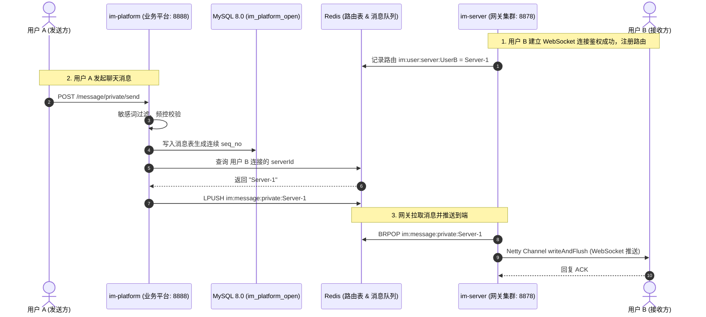

# 盒子IM (Box-IM) - 架构与开发智能指南 (AGENTS.md)

本文档专为开发者与 AI 智能体（Agents）编写，系统梳理了 **Box-IM** 项目的架构模型、模块职责、核心流程、环境准备、启动排错与二次开发最佳实践。

---

## 1. 项目定位与核心特性

**Box-IM** 是一款轻量、高性能、模块解耦的分布式即时通讯（IM）系统。
- **架构解耦**：采用**业务平台（`im-platform`）**与**连接网关（`im-server`）**分离的分层架构，便于水平扩容与连接负载隔离。
- **端侧专注**：专注打造现代化 Web 客户端（基于 Vue 3 + TypeScript + Vite + Element Plus），已彻底剥离移动端 UniApp 依赖以保持极致轻量。
- **功能完备**：支持私聊、群聊、消息撤回/删除、群成员管理、敏感词过滤、文件多媒体上传预览、WebRTC 音视频通话等。

---

## 2. 技术栈清单

| 层次 | 技术选型 | 说明 |
| :--- | :--- | :--- |
| **基础语言与框架** | Java 17, Spring Boot 3.3.1 | 后端核心运行环境与主框架（不使用 Lombok，采用标准原生 POJO） |
| **日志框架** | Log4j2 2.23+ (`spring-boot-starter-log4j2`) | 替代 Logback，基于 SLF4J 统一抽象与异步/滚动日志输出 |
| **长连接网络引擎** | Netty 4.1.x | 高并发 WebSocket 与 TCP 长连接接入网关 |
| **持久层与 ORM** | MyBatis-Plus 3.5.7, Druid 1.1.22 | 数据库访问与连接池管理 |
| **缓存与分布式协调**| Redis 6.2+, Redisson 3.21.3 | 路由表维护、消息队列传输、分布式锁 |
| **对象存储** | 华为云 OBS (Huawei Cloud OBS) 3.26+ | 图片、音频、视频、聊天文件持久化存储 |
| **API 文档与工具** | Knife4j 4.5.0, Hutool 5.8.28 | Swagger/OpenAPI 文档与常用工具库 |
| **Web 前端** | Vue 3.5, Vite 5.4, TypeScript, Pinia, Element Plus | 现代化响应式 Web 客户端，使用 Dexie (IndexedDB) 本地离线存储 |

---

## 3. 仓库结构与各模块职责

```text
box-im/
├── db/                       # 数据库脚本（GoldenDB/MySQL全量初始化脚本、升级补丁）
├── docker/                   # Docker 依赖项数据目录
├── docker-compose.yml        # 本地基础设施一键编排 (MySQL 8.0, Redis)
├── pom.xml                   # Maven 根工程配置
├── im-common/                # 公共基础模块 (DTO/VO、枚举、异常、Redis序列化、常量)
├── im-client/                # IM 客户端 SDK (供业务系统发送消息与接收回调)
├── im-server/                # 连接网关服务 (基于 Netty，负责长连接管理与消息分发)
├── im-platform/              # 核心业务服务 (用户、关系链、群组、消息持久化、WebRTC、文件)
└── im-web/                   # Web 端前端源码 (Vue 3 + Vite + Element Plus)
```

### 各模块详细说明

1. **`im-common`**
   - 定义全系统通用的核心数据结构。
   - `com.bx.imcommon.model`：定义 `IMPrivateMessage<T>`, `IMGroupMessage<T>`, `IMSendResult` 等通信模型。
   - `com.bx.imcommon.enums`：定义 `IMTerminalType`（终端类型）、`IMSendCode`（状态码）、`IMListenerType` 等。
   - `com.bx.imcommon.mq`：定义基于 Redis List 的跨进程消息队列契约。

2. **`im-server` (端口: WebSocket `8878` / TCP `8879`)**
   - 专注于网络长连接的处理，不直连 MySQL，仅依赖 Redis。
   - 维护客户端 WebSocket/TCP 通道（Channel）与用户 ID 的映射关系（`UserChannelCtxMap`）。
   - 在 Redis 中登记当前节点路由：`im:user:server:${userId}` -> `${serverId}`。
   - 独立后台消费线程（`PullPrivateMessageTask`, `PullGroupMessageTask`）监听专属于当前 `serverId` 的 Redis 队列（`im:message:private:${serverId}`），从队列获取待推送消息并经 Netty Channel 推送到客户端。

3. **`im-platform` (端口: HTTP REST `8888`)**
   - 系统的 RESTful API 业务中枢，集成了 Spring Boot、MyBatis-Plus、MySQL、华为云 OBS。
   - **鉴权中心**：基于 JWT 提供登录（`/login`）、注册（`/register`）、Token 刷新（`/refreshToken`）。
   - **社交关系**：好友增删、群组创建、解散、禁言、成员管理等。
   - **消息中枢**：接收前端发送的单聊/群聊请求，完成敏感词校验、防刷限流、消息入库持久化（生成连续单调递增的 `seq_no`）。
   - **路由分发**：根据接收方所连接的 `serverId`，通过 `im-client` 将打包好的消息推入对应的 Redis 队列。
   - **多媒体服务**：整合华为云 OBS 提供通用文件上传、图片缩略图、音视频元数据提取。

4. **`im-client`**
   - 轻量级集成 SDK。`im-platform` 引入此 SDK 即可通过 `IMClient` 接口透明地发送消息，底层自动处理 Redis 队列推入与结果监听。

5. **`im-web` (端口: `8080`)**
   - 使用 Vite 进行构建，采用 Element Plus 样式体系。
   - 内置 WebSocket 自动重连、心跳保持与离线重发策略。
   - 利用浏览器 Dexie (IndexedDB) 进行本地消息存储与会话缓存，降低服务端拉取压力。

---

## 4. 核心消息流转与推送机制



---

## 5. 本地环境依赖与快速启动

### 5.1 环境要求
- **JDK**：OpenJDK 17+
- **Maven**：3.8+ / 3.9+
- **Node.js**：v18+ (推荐 v20)
- **容器环境**：Docker / Docker Compose

### 5.2 第一步：一键启动基础设施 (Docker)
项目根目录下提供了完整的 `docker-compose.yml`，包含预置好的 MySQL 8.0 与 Redis：
```bash
# 启动 MySQL(3306), Redis(6379)
docker compose up -d

# 查看容器运行状态
docker compose ps
```
- **MySQL / GoldenDB**：库名 `im_platform_open`（或企业自定义库名）。本工程彻底剔除了任何自启自动插库/建表逻辑，需由 DBA 或运维手动一次性执行 `db/init_goldendb_mysql.sql`（包含全量 9 张表 DDL 与 468 条敏感词种子数据）。
- **Redis**：`localhost:6379`，无密码。
- **对象存储 (OBS)**：采用华为云 OBS（无需本地部署庞大的存储控制台容器，只需在 `application-dev.yml` 的 `obs:` 节点配置 Endpoint、AK、SK 与 Bucket 即可）。

### 5.3 第二步：构建并启动后端

```bash
# 1. 编译并打包所有模块
mvn clean package -DskipTests

# 2. 启动核心业务服务 im-platform (端口: 8888)
java -jar ./im-platform/target/im-platform.jar &

# 3. 启动连接网关服务 im-server (端口: 8878)
java -jar ./im-server/target/im-server.jar &
```

### 5.4 第三步：启动 Web 前端

```bash
cd im-web
npm install --registry=https://registry.npmmirror.com
npm run dev
```

### 5.5 服务入口导航
- **Web 前端页面**：[http://localhost:8080](http://localhost:8080)
- **后端接口文档 (Knife4j)**：[http://localhost:8888/doc.html](http://localhost:8888/doc.html)
- **WebSocket 服务接入点**：`ws://localhost:8878/im`

---

## 6. 二次开发与编码规范指南

### 6.1 配置文件规范
- 各服务按环境划分配置：`application-dev.yml`、`application-test.yml`、`application-prod.yml`。
- 修改敏感配置（如 OBS 外网访问域名、JWT 秘钥）时，**切记保持 `im-platform` 与 `im-server` 中的 `jwt.accessToken.secret` 一致**，否则长连接鉴权将失败。

### 6.2 扩展新消息类型流程
1. **枚举定义**：在 `im-common/src/main/java/com/bx/imcommon/enums/MessageType.java` 中增加新类型代码（如富文本、红包、位置等）。
2. **DTO 扩展**：若有特定内容载荷，在 `im-platform` 的 DTO 中增加对应模型并在发送前序列化为标准 JSON。
3. **前端渲染**：
   - 在 `im-web/src/components/chat/` 下增加新类型消息的渲染组件；
   - 在 `chatBox` 消息分支匹配中添加针对新增 `type` 的分发逻辑。

### 6.3 数据库设计规范
- 所有主键统一为 `bigint not null auto_increment` 或雪花 ID。
- 涉及增量同步的数据表（如 `im_friend`, `im_group_member`）必须维护单调递增的 `version` 字段，供前端通过版本号进行增量拉取。
- 所有会话消息记录必须保证 `conv_key` 与 `seq_no` 索引，确保私聊群聊离线消息拉取效率。

### 6.4 Git 协同准则
- 主开发分支统一在 **`dev`** 分支提交；
- 保持原开源项目作为 `upstream` 远端，定期执行 `git fetch upstream` 进行框架更新与安全补丁合并。

### 6.5 代码风格与日志规范 (No Lombok & Log4j2)
- **严禁使用 Lombok**：本项目已全量剥离 Lombok 依赖，后续新增任何实体类、DTO、VO 等，均必须直接编写原生标准 Java 代码（包含显式 Getter/Setter、构造器、`toString` 等），禁止引入任何 Lombok 注解。
- **日志记录标准**：统一使用 SLF4J 门面声明 Logger，底层由 `Log4j2` 驱动：
  ```java
  private static final org.slf4j.Logger log = org.slf4j.LoggerFactory.getLogger(YourClass.class);
  ```
- **日志配置文件**：日志行为由各模块下的 `log4j2.xml` 统一管理（支持 Console 与 RollingFile，滚动策略默认 100MB 单文件及保留 60 天）。

